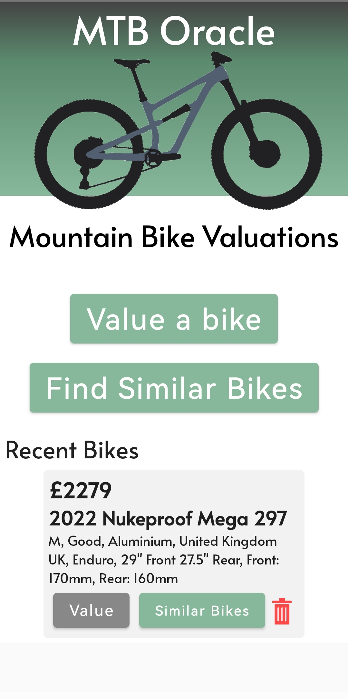
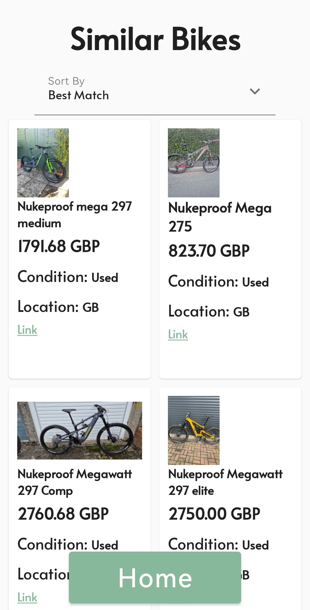
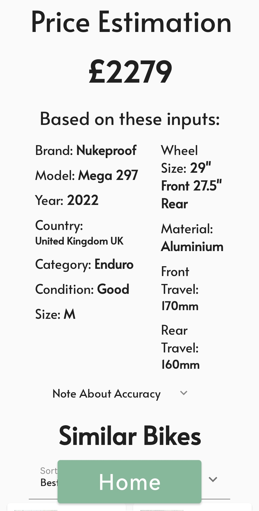

# MTB Oracle

Kotlin Jetpack Compose Android app that can estimate the value of a used mountain bike and locate similar bikes currently on the market.

The value estimation is carried out by a multilayer perceptron (MLP) which is trained on a custom dataset of over 100,000 mountain bikes scraped from the internet*.
The searching of similar bikes is done with the eBay API.

*The dataset was collected in 11/2024 and so with time, the model will become less accurate

### Photos

